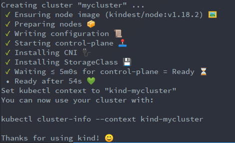
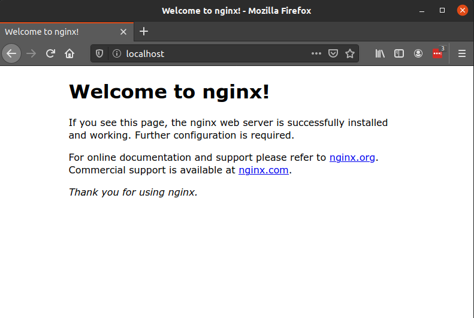
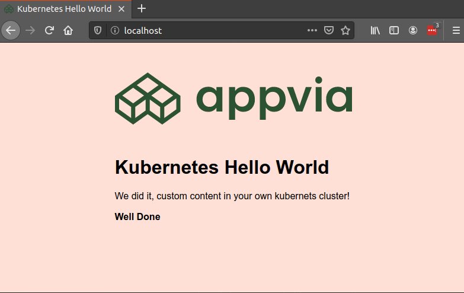

# Your first Kubernetes cluster

You've heard of Kubernetes, but you have never used it and don't know what it can do? Then start here, in this article we will step through setting up your first cluster on your own computer (laptop or desktop computer), and deploy a simple application into the cluster.

Setting a local Kubernetes cluster is made extremely simple today with the wide availability of tools like Minikube, Mikrok8s, Kind and many others besides these, so for this tutorial we'll use `kind`, as it is the fastest to setup with minimal dependencies as long as you can run docker on your machine.

To make things easier you can clone the examples and this article in our public git repository [Kubernetes Hello World](https://github.com/appvia/KubernetesHelloWorld)

## KIND setup

### Requirements (dependencies)

#### Docker

To get `kind` working you will need docker installed.

* On Linux it is best to use your operating system package manager, `apt` on ubuntu or debian, `yum` or `dnf` on Fedora/Centos/RHEL and `pacman` or `yay` on Archlinux.
* On Mac or Windows use the instructions for your platform [here - docker/get-docker](https://docs.docker.com/get-docker/)

#### Kubectl

You will also need the `kubectl` command to interact with the cluster once it's up and running.

* On Linux install the [kubectl install instructions](https://kubernetes.io/docs/tasks/tools/install-kubectl/#install-kubectl-on-linux) are available, including methods to install it with your Linux distributions' packages manager, but it can be installed easily with the following commands:

  ```bash
  curl -LO https://storage.googleapis.com/kubernetes-release/release/`curl -s https://storage.googleapis.com/kubernetes-release/release/stable.txt` /bin/linux/amd64/kubectl
  chmod +x ./kubectl
  sudo mv ./kubectl /usr/local/bin/kubectl
  ```

* On a Mac, it should be easy if you use the `brew` package manager, just run `brew install kubectl`. Further instructions for MacOs are available here in [Kubernetes MacOs kubectl installation instructions](https://kubernetes.io/docs/tasks/tools/install-kubectl/#install-kubectl-on-macos)
* On Windows, of course are also available on the [Kubernetes kubectl installation instructions page](https://kubernetes.io/docs/tasks/tools/install-kubectl/#install-kubectl-on-windows)
 *TODO*  _Does it come with the windows docker installer?_

#### KIND

Finally, you will need to get the `kind` command.

* On Linux or Mac you can install it from the projects [github releases page](https://github.com/kubernetes-sigs/kind/releases), much like the `kubectl` binary, with these commands:
  
  ```bash
  curl -L https://github.com/kubernetes-sigs/kind/releases/download/v0.8.1/kind-linux-amd64 -o kind
  chmod +x ./kind
  sudo mv ./kind /usr/local/bin/kind
  ```

* on a Mac, alternatively it can be installed easily using the `brew` command again, with:

  ```bash
  brew install kind
  ```

* On Windows either use curl if you have it available:

  ```bash
  curl.exe -Lo kind-windows-amd64.exe https://kind.sigs.k8s.io/dl/v0.8.1/kind-windows-amd64
  Move-Item .\kind-windows-amd64.exe c:\some-dir-in-your-PATH\kind.exe
  ```

  Or use the [Chocolatey package manager for windows](https://chocolatey.org/):

  ```bash
  choco install kind
  ```

For full up to date instructions on any of these kind installation methods, see the projects [Quick Start Guide](https://kind.sigs.k8s.io/docs/user/quick-start/).

## Create the cluster

Once all these components are installed, we are ready to create our local Kubernetes cluster.

Kind deploys a Kubernetes instance in a docker container, if you have other containers running on your system, it is best to stop them as they may conflict with the ports used in this example.

`docker ps` will show you any containers running already, if there are any you can stop them all at once using:

```bash
docker stop $(docker ps -a -q)
```

First we need a little configuration to prepare our new Kubernetes node. Make a file as below:

```yaml
# Save this to 'kind.config.yaml'

kind: Cluster
apiVersion: kind.sigs.k8s.io/v1alpha3
nodes:
- role: control-plane
  extraPortMappings:
  - containerPort: 30080
    hostPort: 80
    listenAddress: "0.0.0.0"
    protocol: TCP
```

The extra port mapping is required to allow us to talk to the webserver we will run later on.

```bash
kind create cluster --name mycluster --config config/kind.config.yaml --wait 5m
```

It only takes a few minutes, and after this runs you should see  a friendly message telling you your cluster is ready.



As the output says, the cluster is up and your `kubectl` command configuration is already set to talk to the cluster.

## Deploy an application

Now that we have a cluster up and running, we can run a process. We will run a simple webserver with a "hello world" message of our own creation.

Kubernetes describes all workloads through a simple yaml format file called a "manifest". So to setup something on our cluster we need to write a yaml file to describe what we want to run.

All the manifests for this example deployment can be found in the repository under the `manifests` folder.

First lets describe a workload deployment:

```yaml
apiVersion: apps/v1
kind: Deployment
metadata:
  labels:
    app: example1
  name: example1
spec:
  replicas: 1
  selector:
    matchLabels:
      app: example1
  template:
    metadata:
      labels:
        app: example1
    spec:
      containers:
      - image: nginx:latest
        name: nginx
```

Write this into a yaml file, or use the file from the github repository, and use the kubectl command to apply the workload definition.

```bash
kubectl apply -f manifests/1_helloworld_deploy.yaml
```

This will deploy the nginx docker container and run it as a process on the cluster. Confirm it's running by looking at the resulting pod that's running, `kubectl get pods`
you should see output that looks like the following

```text
NAME                        READY   STATUS    RESTARTS   AGE
example1-7466b89f7c-cs4cc   1/1     Running   0          14s
```

If the "STATUS" field says "Running" it's working as expected. So what actually happened?

When you create a deployment in Kubernetes, the number of replicas you want is set in the manifest, each replica is a copy of the containers that are in the spec. This running instance is actually in an object called a "Pod". A Pod is one or more containers running in a logical group. This allows for a number of useful arrangements, like using multiple processes to deal with processing batch jobs, shipping logs or metrics, or a processes called "initContainers" that runs once to help setup the "Pod" for operation.

In our case we are just running the container for nginx on it's own, no need for any more. The Pod contains our single nginx instance as we intended. We can see the logs of the container as if it were running locally using the following command.

```bash
kubectl logs example1-7466b89f7c-cs4cc
```

You will have to get the id of the running pod from the previous command above, as this is dynamic and will be specific to your instance. But then you should see logs like below

```text
/docker-entrypoint.sh: /docker-entrypoint.d/ is not empty, will attempt to perform configuration
/docker-entrypoint.sh: Looking for shell scripts in /docker-entrypoint.d/
/docker-entrypoint.sh: Launching /docker-entrypoint.d/10-listen-on-ipv6-by-default.sh
10-listen-on-ipv6-by-default.sh: Getting the checksum of /etc/nginx/conf.d/default.conf
10-listen-on-ipv6-by-default.sh: Enabled listen on IPv6 in /etc/nginx/conf.d/default.conf
/docker-entrypoint.sh: Launching /docker-entrypoint.d/20-envsubst-on-templates.sh
/docker-entrypoint.sh: Configuration complete; ready for start up
```

These logs show scripts that run when the container starts up, we will re-visit this later when we've visited our homepage, to see the log entries show up.

## Expose the service

So the process is running, how do we visit the page? Kubernetes offers a powerful service layer to route connections to containers it runs. When you run your pod, you need to specify the ports that it will map onto your container. Then you create a Kubernetes resource called a "Service" that will direct requests to processes running in your pods.

So how do you do this. First lets add the port definitions to the Deployment Pod specification. Replace the spec block from your yaml file with the lines below:

```yaml
    spec:
      containers:
      - image: nginx:latest
        name: nginx
        ports:
        - containerPort: 80
          name: nginx
```

Then apply this file as you did before, for convenience in the git repository we have an example of the file:

```bash
kubectl apply -f manifests/2_helloworld_deploy_ports.yaml
```

To see the change happen, you may be able to see the pod be replaced if you are quick enough. run `kubectl get pods` and you may see something like:

```text
NAME                        READY   STATUS        RESTARTS   AGE
example1-7466b89f7c-cs4cc   1/1     Terminating   0          13h
example1-9f8f59464-x9ntp    1/1     Running       0          2s
```

The "Terminating" instance maybe visible for a very short time, otherwise you will just see the new pod already Running without the old pod in Terminating state. This is how deployments are update in Kubernetes, allowing for rolling upgrades of configuration or container versions.

Now that the pod is setup to receive requests on the port we want, we need to create the Service. To do this you can do this 1 of 2 ways:

1. The preferred method, you can use a service defined in a yaml file, which should look like this:

  ```yaml
  apiVersion: v1
  kind: Service
  metadata:
    name: example1
    labels:
      app: example1
  spec:
    type: NodePort
    selector:
      app: example1
    ports:
      - protocol: TCP
        targetPort: 80
        port: 80
        nodePort: 30080
  ```

  Again an example is provided in the git repo, so you can apply the example manifest or your own file like so:  

  ```bash
  kubectl apply -f manifests/3_helloworld_service.yaml
  ```

2. Otherwise use the kubectl command to "expose" a service. In our case, since we are mapping extra ports in `kind` it can cause a conflict in the ports assigned to our NodePort, so it's not ideal for our example. But for completeness of the explanation, this is a simple method useful in other circumstances and looks like this:

  ```bash
  kubectl expose deployment example1
  ```

Once you've done this you should see the service if you get services:

```bash
 $> kubectl get services
NAME         TYPE        CLUSTER-IP     EXTERNAL-IP   PORT(S)        AGE
example1     NodePort    10.97.195.99   <none>        80:30080/TCP   4s
kubernetes   ClusterIP   10.96.0.1      <none>        443/TCP        15m
```

You will notice 2 services, your example1 and the kubernetes service, this is normal, kind exposes the service you are using to communicate with the cluster in this way.

Now you have your service up and running. Lets see it in a browser, open up the url to `http://localhost` and hit enter, you should see something like this



> "But I want a custom page of my own design"

Ok, no problem. Lets add our own custom html page to the deployment.

The typical way custom content reaches a Kubernetes cluster is by publishing a container with the content bundled to a registry. Many exist such as dockerhub.com, AWS's ECR (Elastic Container Registry), Google's container registry or even a self hosted registry. All of these are outside the scope of this article so we are going to pass content into the existing nginx container with a Kubernetes resource called a configmap.

These resources are a useful way for passing in config files to processes in pods, but in this case, we're going to use one to supply a replacement index.html file to the nginx default `/usr/share/nginx/html` web server file path.

For convenience there is a html file in the `html/` folder in the git repository. Add the config map using this command.

```bash
kubectl create configmap index.html --from-file html/index.html
```

You can see it created successfully using the command `kubectl get configmaps` which should show the result below:

```text
NAME         DATA   AGE
index.html   1      33s
```

To see what is in the configmap for your own curiosity, you can run `kubectl describe configmap index.html`.

Now we just need to tell the nginx Pod to read from this configmap for its content. Lets update the deployment file one more time to add a Volume mount, essentially treating the content of the content map like a mountable file inside the file system of the nginx container.

Update your yaml file with the new content below at the end of the file:

```yaml
        volumeMounts:
        - name: htmlcontent
          mountPath: "/usr/share/nginx/html/"
          readOnly: true
      volumes:
      - name: htmlcontent
        configMap:
          name: index.html
          items:
          - key: index.html
            path: index.html
```

..or use the file in the git repository and apply the change to your deployment with the command as below.

```bash
kubectl apply -f manifests/4_helloworld_deploy_content.yaml
```

Finally we will see the deployment update which can be done with `kubectl get pods` which again we can see a Terminating pod being replaced with a new Pod.

```text
NAME                        READY   STATUS        RESTARTS   AGE
example1-587454c8fb-4llk9   1/1     Terminating   0          177m
example1-566dd9577f-j48bh   1/1     Running       0          2s
```

Finally you can view the updated content on our `localhost` page in your browser and see the lovely
 branded helloworld page.



## Set your own text

Now for your own enjoyment, try updating the `images/index.html` file with your own text. Update the configmap with your new content, this requires a little command line trickery, but with the following command you can replace the existing configmap content with your new index.html file content.

```bash
kubectl create configmap index.html --from-file html/index.html -oyaml --dry-run | kubectl replace -f -
```

To get the nginx Pod to reload mounting the new value of the configmap, you need to get the pod to recreate. Do this using the following command:

```bash
kubectl rollout restart deployment example1
```

This will tell the deployment to re-deploy it's pod's, so if you do `kubectl get pods` again, you will see the rolling change happening.

```text
NAME                        READY   STATUS              RESTARTS   AGE
example1-566dd9577f-j48bh   1/1     Running             0          14m
example1-78df6fc9ff-l98cg   0/1     ContainerCreating   0          3s
```

Reload your browser and you will see your clever and witty message!

## Cleanup

When you are all done with your test cluster, you can clean it up easily with the following command.

```bash
kind delete cluster --name mycluster
```

This deletes the docker container that is running your cluster, and thankfully clears up the kubectl config file for you too so you don't have to worry about cleaning up your home .kube/config file.

## Next steps

If you want to explore more advanced topics...

_TODO: next article suggestions, or external links
